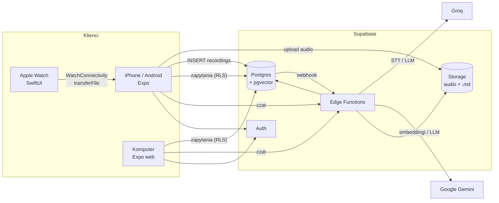

# Architektura

Dokument opisuje **stan docelowy**. Różnice względem obecnego kodu są w sekcji [10. Stan obecny a docelowy](#10-stan-obecny-a-docelowy).

## 1. Przegląd



Zasady nadrzędne:

1. **Klucze AI nigdy nie trafiają do aplikacji klienckiej.** Każde wywołanie AI przechodzi przez Edge Functions.
2. **Baza danych jest źródłem prawdy.** Pliki `.md` są z niej generowane szablonem.
3. **Nagranie nie może zginąć.** Klient trzyma kolejkę lokalną, a serwer przechowuje status każdego kroku i ponawia nieudane kroki.
4. **Izolacja danych przez RLS.** Każda tabela i każdy bucket ma polityki oparte na `auth.uid()`.

## 2. Komponenty

| Komponent | Technologia | Odpowiedzialność |
|---|---|---|
| Aplikacja mobilna | Expo / React Native (iOS, Android) | nagrywanie, kolejka offline, pamiętnik, analizy, czat, „Powiązane myśli” |
| Aplikacja webowa | Expo web (ten sam kod) | graf, czat, przeglądanie dokumentów, eksport |
| Aplikacja zegarka | SwiftUI (watchOS), target dodawany wtyczką konfiguracyjną | nagrywanie, kolejka na zegarku, przesyłanie do iPhone'a |
| Moduł WatchConnectivity | lokalny moduł Expo (Swift) w `modules/` | odbiór plików z zegarka po stronie iPhone'a |
| Auth | Supabase Auth | logowanie Google i Apple (`signInWithIdToken`) |
| Baza | Supabase Postgres + `pgvector`, `pg_cron`, `pg_net`, `unaccent` | dane, wektory, wyszukiwanie, kolejki zadań |
| Pliki | Supabase Storage (prywatne buckety) | audio, pliki `.md` |
| Backend | Supabase Edge Functions (Deno, TypeScript) | przetwarzanie nagrań, wpis dnia, czat, usuwanie konta |
| AI | Groq, Google Gemini, za wspólnym interfejsem | STT, LLM, embeddingi |

## 3. Warstwy w aplikacji klienckiej

Kod w `src/` zachowuje podział na warstwy:

```
src/
  domain/          modele, interfejsy repozytoriów i serwisów; bez zależności od bibliotek
  application/     przypadki użycia i store'y (zustand); zależy tylko od domain
  infrastructure/  Supabase, audio, kolejka (expo-sqlite), moduł zegarka; implementuje interfejsy z domain
  presentation/    ekrany i komponenty; korzysta z application, nigdy bezpośrednio z infrastructure
```

Instancje z `infrastructure` tworzy jedno miejsce (composition root), a nie ekrany. Dziś tę zasadę łamią `OnboardingScreen` i store'y, co jest do poprawy w fazie 1.

## 4. Model danych

### Tabele

```sql
profiles (
  user_id uuid PK -> auth.users ON DELETE CASCADE,
  life_goals text[], ai_personality text, theme text,
  timezone text NOT NULL,            -- „dzień” jest liczony w strefie użytkownika
  current_streak int, last_entry_day date, badges text[],
  created_at, updated_at
)

recordings (
  id uuid PK,                        -- generowane przez klienta/zegarek: klucz idempotencji
  user_id uuid, source text,         -- 'phone' | 'watch' | 'web'
  recorded_at timestamptz, duration_ms int,
  audio_path text,                   -- ścieżka w buckecie recordings
  raw_transcript text,               -- surowa transkrypcja, nigdy nie jest nadpisywana
  status text,                       -- 'uploaded' | 'transcribed' | 'segmented' | 'done' | 'failed'
  attempts int, last_error text, created_at
)

documents (
  id uuid PK, user_id uuid,
  kind text,                         -- 'note' | 'daily'
  note_type text NULL,               -- 'idea' | 'task' | 'reflection' | 'event' (tylko dla 'note')
  day date,                          -- dzień w strefie użytkownika
  title text, slug text,             -- slug jest stały po utworzeniu (odnośniki się nie psują)
  data jsonb,                        -- dane strukturalne (dla 'daily': analiza dnia + ideas[])
  body_md text,                      -- wygenerowany Markdown
  md_path text,                      -- ścieżka pliku w buckecie documents
  category_id uuid NULL, tags text[],
  recording_id uuid NULL, schema_version int,
  created_at, updated_at,
  UNIQUE (user_id, slug),
  UNIQUE (user_id, day) WHERE kind = 'daily'
)

document_chunks (
  id uuid PK, document_id uuid -> documents ON DELETE CASCADE, user_id uuid,
  idx int, content text,
  embedding vector(1536), embedding_model text,  -- zmiana modelu = ponowne liczenie embeddingów
  fts tsvector GENERATED                         -- konfiguracja 'simple' + unaccent (brak polskiego słownika)
)

links (
  user_id uuid, source_id uuid, target_id uuid,
  kind text,                         -- 'semantic' | 'llm' | 'day' | 'wikilink' | 'manual'
  score real, reason text, created_at,
  PRIMARY KEY (source_id, target_id, kind)
)

categories (id uuid PK, user_id uuid, name text, color text, UNIQUE (user_id, name))
day_rebuild_queue (user_id uuid, day date, requested_at timestamptz, PRIMARY KEY (user_id, day))
chat_threads (id, user_id, title, created_at)
chat_messages (id, thread_id, user_id, role, content, citations jsonb, created_at)
```

Indeksy: HNSW na `document_chunks.embedding` (`vector_cosine_ops`), GIN na `fts`, btree na `(user_id, day)` i `(user_id, kind)`.

Wymiar 1536 jest wybrany celowo: indeks HNSW dla typu `vector` obsługuje maksymalnie 2000 wymiarów.

### Funkcje RPC

| Funkcja | Zastosowanie |
|---|---|
| `search_chunks(query_embedding, query_text, date_from, date_to, kinds, category_ids, k)` | wyszukiwanie hybrydowe (wektor + pełny tekst, łączone metodą Reciprocal Rank Fusion) z filtrami |
| `similar_documents(document_id, k)` | kandydaci na powiązania i sekcja „Powiązane myśli” |
| `get_graph(date_from, date_to, category_ids, note_types, min_score)` | węzły i krawędzie grafu |

### Storage

| Bucket | Ścieżka |
|---|---|
| `recordings` (prywatny) | `{user_id}/{recording_id}.m4a` |
| `documents` (prywatny) | `{user_id}/daily/{YYYY-MM-DD}.md`, `{user_id}/notes/{slug}.md` |

Polityki Storage: pierwszy segment ścieżki musi być równy `auth.uid()`. Klient pobiera pliki przez podpisane adresy URL.

## 5. Dokumenty Markdown

### Zasady
- **Źródłem prawdy jest wiersz w `documents`.** Kolumna `body_md` i plik w Storage powstają deterministycznie z szablonu i danych strukturalnych, bez udziału LLM.
- Po każdej zmianie danych dokument jest renderowany ponownie i nadpisywany w Storage.
- Plik ma nazwę `{YYYY-MM-DD}-{slug-tytułu}`. Przy kolizji dodawany jest krótki sufiks z identyfikatora. Slug nie zmienia się po utworzeniu.
- Odnośniki mają postać `[[slug|Tytuł]]`, zgodną z Obsidianem.
- Wpis dnia jest w aplikacji tylko do odczytu (AI generuje go od nowa). Ewentualne ręczne dopiski to otwarta kwestia w [05-decyzje.md](05-decyzje.md).

### Notatka

```markdown
---
type: note
id: 4f1c2a…
note_type: idea
date: 2026-09-23
recorded_at: 2026-09-23T09:14:00+02:00
category: Praca
tags: [projekt-xyz, ux]
daily: "[[2026-09-23]]"
related: ["[[2026-09-20-nowy-onboarding|Nowy onboarding]]"]
source: watch
---
# Aplikacja do grafu myśli

Oczyszczona treść notatki…
```

### Wpis dnia

```markdown
---
type: daily
date: 2026-09-23
emotions: [Radość, Ulga]
fatigue: 4
stress_vs_calm: calm
goal_impact: positive
personality: Józef Piłsudski
tags: [praca, projekt-xyz]
---
# Wtorek, 23 września 2026

> Wiodąca myśl dnia

## Podsumowanie
## 💡 Pomysły, na które wpadłem
- [[2026-09-23-aplikacja-do-grafu-mysli|Aplikacja do grafu myśli]] – jedno zdanie opisu
## Zrobione
## Ważne wydarzenia
## Emocje i wyzwalacze
## Wdzięczność
## Wpływ na cele
## Rada
## Najważniejsze słowa
## Nagrania dnia
- 09:14 [[…]] · 18:40 [[…]]
```

Kolumna `documents.data` dla wpisu dnia ma strukturę dzisiejszego `ParsedDiaryData` (`src/domain/models/DiaryEntry.ts`) rozszerzoną o `ideas: { documentId, title, oneLiner }[]`. Na niej działają ekrany szczegółów i analiz.

## 6. Przepływy

### 6.1 Nagranie z telefonu

```
1. Aplikacja: stop nagrywania → zapis pliku + wiersza w lokalnej kolejce (expo-sqlite), id = UUID
2. Kolejka: upload do Storage recordings/{uid}/{id}.m4a → INSERT recordings (status 'uploaded')
   ponawianie z wykładniczym odstępem; ponowne wysłanie jest bezpieczne (to samo id)
3. Webhook bazy (INSERT recordings) → Edge Function process-recording:
   a. transkrypcja → raw_transcript, status 'transcribed'
   b. LLM: podział na notatki + typ/tytuł/kategoria/tagi (walidacja zod) → status 'segmented'
   c. dla każdej notatki: INSERT documents → render .md → chunki + embeddingi
   d. powiązania: similar_documents → LLM ocenia kandydatów (tylko ID z listy) → INSERT links
   e. UPSERT day_rebuild_queue (user_id, day) → status 'done'
4. Aplikacja śledzi status przez Supabase Realtime
```

Każdy krok sprawdza bieżący status i jest idempotentny, więc powtórne uruchomienie kontynuuje od miejsca przerwania. `pg_cron` co kilka minut ponawia nagrania, które utknęły, z limitem `attempts`. Edge Functions mają limit czasu wykonania. Przy długich nagraniach kroki mogą wymagać rozbicia na osobne wywołania.

### 6.2 Nagranie z Apple Watch (MVP)

```
1. Zegarek: AVAudioRecorder (AAC, mono, jakość mowy) → plik + lokalna kolejka, id = UUID
2. Zegarek: WCSession.transferFile(plik, metadata {id, recordedAt, durationMs})
   system dostarcza plik, gdy iPhone jest osiągalny, także po restarcie
3. iPhone: moduł Expo (Swift, WCSessionDelegate, aktywowany przy starcie aplikacji):
   przenosi plik do Documents/watch-inbox/ i zapisuje manifest, emituje zdarzenie do JS
4. JS: przy starcie, powrocie na pierwszy plan i po zdarzeniu przenosi pliki z inboxu
   do tej samej kolejki co nagrania z telefonu (source 'watch') → dalej jak w 6.1
5. iPhone odsyła do zegarka status nagrania (WCSession.updateApplicationContext)
```

Po MVP: zegarek wysyła nagrania bezpośrednio do Supabase (URLSession w tle). Sesję (tokeny) dostaje z iPhone'a przez WatchConnectivity. Ten sam UUID gwarantuje brak duplikatów.

### 6.3 Przebudowa wpisu dnia

```
1. pg_cron co 5 min: dni z day_rebuild_queue starsze niż 10 min (odczekanie na kolejne nagrania)
   lub wywołanie na żądanie z aplikacji (użytkownik otwiera dzisiejszy wpis)
2. Edge Function build-daily:
   a. pobiera notatki z dnia, cele życiowe i osobowość z profiles
   b. LLM: analiza dnia (obecny prompt z osobowością) + wybór pomysłów spośród notatek typu 'idea'
   c. walidacja zod → UPSERT documents (kind 'daily') → render .md → chunki + embeddingi
   d. links kind 'day' (wpis dnia → notatki dnia)
   e. aktualizacja serii i odznak w profiles
```

### 6.4 Czat (RAG)

```
1. Aplikacja → Edge Function chat (streaming SSE)
2. LLM przepisuje pytanie na {search_query, date_from, date_to, kinds, categories}
   w strefie czasowej użytkownika („wczoraj” staje się zakresem dat)
3. Embedding zapytania → search_chunks z filtrami → top-k fragmentów
4. LLM odpowiada wyłącznie na podstawie fragmentów, cytując [doc:<id>]
5. Zapis chat_messages z citations; aplikacja zamienia cytaty na odnośniki
```

### 6.5 Graf

Klient wywołuje `get_graph` z filtrami i renderuje wynik przez `react-force-graph-2d`. Na webie jest to zwykły komponent, a w aplikacji natywnej komponent DOM Expo (`'use dom'`). Filtrowanie wstępne robi SQL, a szybkie przełączanie filtrów odbywa się lokalnie na pobranych danych.

## 7. Warstwa AI

- Kod AI działa tylko w `supabase/functions/`. Wspólne elementy leżą w `supabase/functions/_shared/`:
  - `ai/`: interfejsy `SttProvider`, `LlmProvider`, `EmbeddingProvider` oraz adaptery `groq`, `gemini`.
  - `prompts/`: prompty jako pliki z numerem wersji. Osobowości AI są osobnymi fragmentami promptu.
  - `schemas/`: schematy zod dla każdej odpowiedzi LLM.
- Dostawcę i model wybiera się osobno dla każdego zadania zmiennymi środowiskowymi (patrz [03-stos-technologiczny.md](03-stos-technologiczny.md)). Zmiana LLM nie wymaga zmian w kodzie.
- Każda odpowiedź LLM przechodzi walidację. Przy błędzie następuje jedna próba naprawy, a potem status `failed` z opisem błędu.
- LLM, który proponuje powiązania albo pomysły dnia, dostaje listę kandydatów z identyfikatorami. Identyfikatory spoza listy są odrzucane.
- Treść notatek jest danymi, a nie instrukcjami. Prompty oddzielają transkrypcję od poleceń, żeby nagrana treść nie sterowała modelem.

## 8. Bezpieczeństwo i prywatność

- Dane o emocjach i samopoczuciu traktujemy jak dane wrażliwe (możliwe dane o zdrowiu w rozumieniu RODO, art. 9).
- Klucze AI i `service_role` są tylko w sekretach Supabase. Klient ma wyłącznie publiczny klucz (anon/publishable) i adres projektu.
- RLS jest włączone na każdej tabeli, z politykami `user_id = auth.uid()`. Buckety są prywatne.
- Logi nie zawierają treści transkrypcji ani notatek.
- Polityka prywatności i etykiety App Store muszą wymieniać przekazywanie treści do Groq i Google.
- Edge Function `delete-account` usuwa pliki ze Storage i konto, a reszta danych znika kaskadowo. To wymóg App Store dla aplikacji z kontami.
- Logowanie na iOS: Google i Sign in with Apple (wytyczna App Store 4.8).

## 9. Niezawodność

| Ryzyko | Zabezpieczenie |
|---|---|
| brak sieci przy nagrywaniu | lokalna kolejka na telefonie i zegarku |
| błąd AI lub przekroczenie limitu | status + `attempts` + ponawianie przez `pg_cron`; surowe audio zawsze w Storage |
| duplikaty | UUID nagrania od klienta = klucz główny |
| rozjazd formatu odpowiedzi LLM | zod + `schema_version` w dokumentach |
| zmiana modelu embeddingów | `embedding_model` w chunkach + skrypt ponownego liczenia |

## 10. Stan obecny a docelowy

| Obszar | Stan obecny ✅ | Stan docelowy 📋 |
|---|---|---|
| Auth | Firebase Auth (Google) | Supabase Auth (Google + Apple) |
| Dane | Firestore `users/{uid}/diary_entries`, jeden dokument na dzień | Postgres: `recordings`, `documents`, `links`, … |
| Wywołania AI | z aplikacji, klucz Groq w pakiecie aplikacji | Edge Functions, klucze w sekretach |
| Model wpisu | nagrania doklejane do jednego tekstu dnia, który LLM za każdym razem przepisuje | notatki atomowe + wpis dnia generowany z notatek |
| Surowa transkrypcja | nie jest przechowywana | `recordings.raw_transcript` |
| Audio | plik tymczasowy, gubiony przy błędzie | Storage + kolejka offline |
| Ustawienia i grywalizacja | AsyncStorage + dokument `users/{uid}` | `profiles` |
| Zegarek, graf, czat, web | brak | M5, M6, M9, M10 |

Znane błędy obecnego kodu są wypisane w [04-roadmapa.md](04-roadmapa.md).
