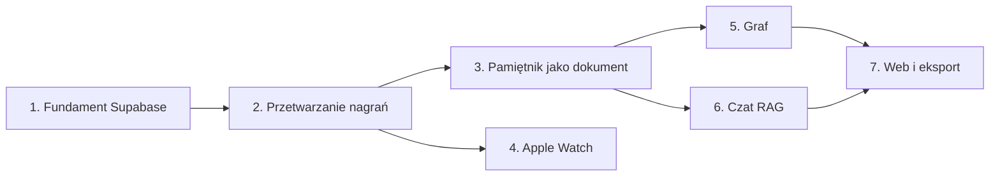

# Roadmapa

Fazy są uporządkowane według zależności. Faza 4 (Apple Watch) zależy tylko od fazy 2 i może iść równolegle z fazą 3. Po ukończeniu zadania zaznacz pole `[x]` w tym pliku (patrz [06-zasady-pracy.md](06-zasady-pracy.md)).

## Faza 1: Fundament Supabase

- [ ] Projekt Supabase, katalog `supabase/` w repozytorium (CLI, lokalne środowisko)
- [ ] Migracje: wszystkie tabele z [02-architektura.md](02-architektura.md#4-model-danych), RLS, indeksy, buckety i polityki Storage
- [ ] Logowanie Google przez `signInWithIdToken`; Sign in with Apple na iOS
- [ ] Tabela `profiles` zamiast synchronizacji ustawień przez Firestore/AsyncStorage (cele, osobowość, motyw, strefa czasowa, grywalizacja)
- [ ] Wylogowanie czyści wszystkie store'y (dziś cele poprzedniego użytkownika zostają na urządzeniu)
- [ ] Usunięcie Firebase i martwych zależności (lista w [03-stos-technologiczny.md](03-stos-technologiczny.md#do-usunięcia-))
- [ ] Unieważnienie obecnego klucza Groq; klucze przeniesione do sekretów Supabase
- [ ] ESLint zainstalowany, `design_exports/` wykluczony z `tsconfig.json`, `tsc --noEmit` bez błędów
- [ ] Composition root: ekrany nie tworzą serwisów z `infrastructure`

**Gotowe, gdy:** można się zalogować (Google, Apple), przejść onboarding, a profil zapisuje się w Supabase. W kodzie nie ma Firebase, a `tsc` i lint przechodzą.

## Faza 2: Przetwarzanie nagrań

- [ ] Lokalna kolejka nagrań (`expo-sqlite`) z ponawianiem wysyłki
- [ ] Wysyłka do Storage + `INSERT recordings` z UUID klienta
- [ ] `_shared/ai`: interfejsy i adaptery Groq i Gemini, konfiguracja przez zmienne środowiskowe
- [ ] Edge Function `process-recording`: transkrypcja → podział na notatki → dokumenty `.md` → chunki i embeddingi → powiązania
- [ ] Schematy zod dla odpowiedzi LLM, prompty jako wersjonowane pliki
- [ ] Webhook bazy + ponawianie przez `pg_cron`
- [ ] Aplikacja: lista notatek, status nagrań na żywo (Realtime), ponowienie po błędzie
- [ ] Ustawienia nagrywania pod mowę, poprawka nazwy zdarzenia w `expoAudioRecorder.ts`

**Gotowe, gdy:** nagranie w trybie samolotowym zostaje wysłane po odzyskaniu sieci, a jedno nagranie z trzema myślami daje trzy notatki z typami, kategoriami i powiązaniami. Błąd AI nie usuwa nagrania.

## Faza 3: Pamiętnik jako dokument

- [ ] Edge Function `build-daily` z odczekaniem (`day_rebuild_queue` + `pg_cron`) i wywołaniem na żądanie
- [ ] Sekcja „Pomysły, na które wpadłem” (odnośniki do notatek typu `idea`)
- [ ] Szablony `.md` dla notatki i wpisu dnia, zapis do Storage
- [ ] Ekran szczegółów dnia czyta `documents.data`; podgląd `.md`
- [ ] Analizy i seria dni liczone z wpisów dnia; seria i odznaki po stronie serwera
- [ ] Zgodność z celami liczona z `goalImpactType`
- [ ] Udostępnianie kart działa na nowym modelu

**Gotowe, gdy:** kilka nagrań z jednego dnia daje jeden wpis dnia ze wszystkimi dotychczasowymi sekcjami i listą pomysłów, a plik `.md` otwiera się poprawnie w Obsidianie.

## Faza 4: Apple Watch

- [ ] Target watchOS przez `@bacons/apple-targets` (`targets/watch/`), budowany przez EAS
- [ ] Nagrywanie na zegarku, kolejka lokalna, `WCSession.transferFile` z metadanymi
- [ ] Moduł Expo `modules/watch-connectivity/`: odbiór plików, inbox, zdarzenie do JS
- [ ] Nagrania z zegarka trafiają do tej samej kolejki (`source = 'watch'`)
- [ ] Status nagrań odsyłany na zegarek
- [ ] Po MVP: komplikacja, Action Button, wysyłanie bezpośrednio z zegarka

**Gotowe, gdy:** nagranie z zegarka przy wyłączonym Bluetooth na iPhonie trafia do bazy po ponownym połączeniu, bez duplikatów, a zegarek pokazuje status „przetworzone”.

## Faza 5: Graf

- [ ] RPC `get_graph` z filtrami
- [ ] Komponent grafu (`react-force-graph-2d`) na webie i przez komponent DOM Expo na natywnych platformach
- [ ] Wpisy dnia jako węzły centralne, kolory według kategorii, filtry
- [ ] „Powiązane myśli” w szczegółach dokumentu (`similar_documents` + `links`)

**Gotowe, gdy:** graf działa płynnie przy 2000 dokumentach na komputerze, a kliknięcie węzła otwiera dokument.

## Faza 6: Czat RAG

- [ ] RPC `search_chunks` (hybrydowe wyszukiwanie z filtrami)
- [ ] Edge Function `chat`: przepisanie zapytania na filtry dat, wyszukiwanie, odpowiedź strumieniowana z cytatami
- [ ] Wątki czatu, cytaty jako odnośniki do dokumentów i grafu
- [ ] Zestaw pytań testowych do oceny jakości (w tym pytania o daty)

**Gotowe, gdy:** pytanie „Jakie miałem wczoraj pomysły?” zwraca wyłącznie wczorajsze notatki typu `idea` z cytatami.

## Faza 7: Web i eksport

- [ ] Układ dla komputera: graf i czat obok siebie, lista dokumentów
- [ ] Eksport `.zip` z plikami `.md` (sejf Obsidiana)
- [ ] Edge Function `delete-account` + opcja w ustawieniach

## Znane błędy obecnego kodu

Pochodzą z audytu z 2026-09-23. Błędy związane z Firestore znikną razem z nim w fazie 1.

| Plik | Problem | Faza |
|---|---|---|
| `src/infrastructure/ai/groqService.ts` | klucz Groq w pakiecie aplikacji (`EXPO_PUBLIC_`) | 1 |
| `src/application/store/useDiaryStore.ts` | błąd przetwarzania gubi nagranie (brak kolejki i ponawiania) | 2 |
| `src/application/useCases/recordAndProcess.ts` | tekst dnia doklejany i za każdym razem przepisywany przez LLM; surowa transkrypcja nie jest przechowywana | 2–3 |
| `src/presentation/screens/SettingsScreen.tsx`, `useSettingsStore.ts` | wylogowanie zostawia cele i motyw poprzedniego użytkownika | 1 |
| `src/presentation/screens/DetailScreen.tsx` | `emotionTriggers` nie ma w `pData`, więc wyzwalacze emocji nigdy się nie wyświetlają | 3 |
| `src/infrastructure/audio/expoAudioRecorder.ts` | nasłuch na złe zdarzenie (`'RECORDING_STATUS_UPDATE'`), zdublowane `return null`, nieudokumentowane `new AudioModule.AudioRecorder` | 2 |
| `src/application/useCases/statsUseCase.ts` | `setHours` zmienia daty wpisów w stanie aplikacji; „zgodność z celami” to heurystyka, która pomija `goalImpactType` | 3 |
| `src/infrastructure/ai/groqService.ts` | odpowiedź LLM tylko rzutowana na typ, bez walidacji | 2 |
| `src/presentation/screens/OnboardingScreen.tsx` | `join('\\n\\n')` łączy odpowiedzi dosłownym tekstem „\n\n” | 1 |
| `App.tsx` | `[initializing]` w zależnościach efektu podwójnie rejestruje nasłuch logowania | 1 |
| `package.json` | lint-staged wywołuje niezainstalowany ESLint | 1 |
| `tsconfig.json` | sprawdza `design_exports/`, co daje fałszywe błędy; w `src/` jest 13 błędów typów | 1 |
