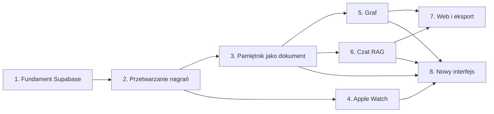

# Roadmapa

Fazy są uporządkowane według zależności. Faza 4 (Apple Watch) zależy tylko od fazy 2 i może iść równolegle z fazą 3. Po ukończeniu zadania zaznacz pole `[x]` w tym pliku (patrz [06-zasady-pracy.md](06-zasady-pracy.md)).

```mermaid
flowchart LR
  F1[1. Fundament Supabase] --> F2[2. Przetwarzanie nagrań]
  F2 --> F3[3. Pamiętnik jako dokument]
  F2 --> F4[4. Apple Watch]
  F3 --> F5[5. Graf]
  F3 --> F6[6. Czat RAG]
  F5 --> F7[7. Web i eksport]
  F6 --> F7
  F3 --> F8[8. Nowy interfejs]
  F4 --> F8
  F5 --> F8
  F6 --> F8
```

## Faza 1: Fundament Supabase

- [x] Projekt Supabase, katalog `supabase/` w repozytorium (CLI, lokalne środowisko)
- [x] Migracje: wszystkie tabele z [02-architektura.md](02-architektura.md#4-model-danych), RLS, indeksy, buckety i polityki Storage
- [x] Logowanie Google przez `signInWithIdToken`; Sign in with Apple na iOS
- [x] Tabela `profiles` zamiast synchronizacji ustawień przez Firestore/AsyncStorage (cele, osobowość, motyw, strefa czasowa, grywalizacja)
- [x] Wylogowanie czyści wszystkie store'y (dziś cele poprzedniego użytkownika zostają na urządzeniu)
- [x] Usunięcie Firebase i martwych zależności (lista w [03-stos-technologiczny.md](03-stos-technologiczny.md#do-usunięcia-))
- [x] Unieważnienie obecnego klucza Groq; klucze przeniesione do sekretów Supabase
- [x] ESLint zainstalowany, `design_exports/` wykluczony z `tsconfig.json`, `tsc --noEmit` bez błędów
- [x] Composition root: ekrany nie tworzą serwisów z `infrastructure`
- [x] Logowanie Google na iOS: `iosUrlScheme` w konfiguracji wtyczki Google Sign-In w `app.json`
- [x] Logowanie Apple: nonce hashowany SHA-256 i `appleTeamId` w `app.json`

**Gotowe, gdy:** można się zalogować (Google, Apple), przejść onboarding, a profil zapisuje się w Supabase. W kodzie nie ma Firebase, a `tsc` i lint przechodzą.

## Faza 2: Przetwarzanie nagrań

- [x] Lokalna kolejka nagrań (`expo-sqlite`) z ponawianiem wysyłki
- [x] Wysyłka do Storage + `INSERT recordings` z UUID klienta
- [x] `_shared/ai`: interfejsy i adaptery Groq i Gemini, konfiguracja przez zmienne środowiskowe
- [x] Edge Function `process-recording`: transkrypcja → podział na notatki → dokumenty `.md` → chunki i embeddingi → powiązania
- [x] Schematy zod dla odpowiedzi LLM, prompty jako wersjonowane pliki
- [x] Webhook bazy + ponawianie przez `pg_cron`
- [x] Aplikacja: lista notatek, status nagrań na żywo (Realtime), ponowienie po błędzie
- [x] Ustawienia nagrywania pod mowę, poprawka nazwy zdarzenia w `expoAudioRecorder.ts`
- [ ] Domyślny model Groq dla zadań LLM: `openai/gpt-oss-120b` zamiast `llama-3.3-70b-versatile`
- [x] Nagranie z telefonu trafia tylko do kolejki i na serwer: bez transkrypcji i analizy LLM w aplikacji (ADR-003)

**Gotowe, gdy:** nagranie w trybie samolotowym zostaje wysłane po odzyskaniu sieci, a jedno nagranie z trzema myślami daje trzy notatki z typami, kategoriami i powiązaniami. Błąd AI nie usuwa nagrania.

## Faza 3: Pamiętnik jako dokument

- [x] Migracja: harmonogram `pg_cron` (odczekanie po zmianach w `day_rebuild_queue`) i RPC do żądania natychmiastowej przebudowy wpisu dnia
- [x] Edge Function `build-daily`: analiza dnia, sekcja „Pomysły, na które wpadłem” (odnośniki do notatek typu `idea`), szablon `.md` wpisu dnia, zapis do Storage, chunki i embeddingi, aktualizacja serii/odznak i zgodności z celami (`goalImpactType`) w `profiles`
- [x] Ekran szczegółów dnia czyta `documents.data`; podgląd `.md`
- [x] Analizy i seria dni w aplikacji czytają dane policzone po stronie serwera (bez lokalnego przeliczania)
- [x] Udostępnianie kart działa na nowym modelu (`documents` zamiast starego store'u)
- [x] Lista wpisów dnia na ekranie głównym czyta `documents` (`kind = daily`) zamiast starego store'u

**Gotowe, gdy:** kilka nagrań z jednego dnia daje jeden wpis dnia ze wszystkimi dotychczasowymi sekcjami i listą pomysłów, a plik `.md` otwiera się poprawnie w Obsidianie.

## Faza 4: Apple Watch

- [x] Target watchOS przez `@bacons/apple-targets` (`targets/watch/`), budowany przez EAS
- [x] Nagrywanie na zegarku: `AVAudioRecorder`, lokalna kolejka, `WCSession.transferFile` z metadanymi
- [x] Moduł Expo `modules/watch-connectivity/`: odbiór plików na iPhonie, inbox, zdarzenie do JS
- [x] Nagrania z zegarka trafiają do tej samej kolejki (`source = 'watch'`)
- [x] Status nagrań: API modułu zegarka (`WCSession.updateApplicationContext`, UI statusu na zegarku)
- [x] Status nagrań: aplikacja wywołuje API modułu przy zmianie statusu nagrania z zegarka
- [x] Ikona aplikacji zegarka (`AppIcon`, `CFBundleIconName`) wymagana przez App Store Connect
- [ ] Po MVP: komplikacja, Action Button, wysyłanie bezpośrednio z zegarka

**Gotowe, gdy:** nagranie z zegarka przy wyłączonym Bluetooth na iPhonie trafia do bazy po ponownym połączeniu, bez duplikatów, a zegarek pokazuje status „przetworzone”.

## Faza 5: Graf

- [x] RPC `get_graph` z filtrami
- [x] Komponent grafu (`react-force-graph-2d`) na webie i przez komponent DOM Expo na natywnych platformach
- [x] Wpisy dnia jako węzły centralne, kolory według kategorii, filtry
- [x] „Powiązane myśli” w szczegółach dokumentu (`similar_documents` + `links`)

**Gotowe, gdy:** graf działa płynnie przy 2000 dokumentach na komputerze, a kliknięcie węzła otwiera dokument.

## Faza 6: Czat RAG

- [x] RPC `search_chunks` (hybrydowe wyszukiwanie z filtrami)
- [x] Edge Function `chat`: przepisanie zapytania na filtry dat, wyszukiwanie, odpowiedź strumieniowana z cytatami
- [x] Wątki czatu, cytaty jako odnośniki do dokumentów i grafu
- [x] Zestaw pytań testowych do oceny jakości (w tym pytania o daty)

**Gotowe, gdy:** pytanie „Jakie miałem wczoraj pomysły?” zwraca wyłącznie wczorajsze notatki typu `idea` z cytatami.

## Faza 7: Web i eksport

- [ ] Zależności webowe Expo: `react-native-web`, `react-dom`, `@expo/metro-runtime`
- [ ] Web: bundle bez `expo-sqlite` (kolejka nagrań w wariancie platformowym `*.web.ts`)
- [ ] Układ dla komputera: graf i czat obok siebie, lista dokumentów
- [ ] Eksport `.zip` z plikami `.md` (sejf Obsidiana)
- [ ] Edge Function `delete-account` + opcja w ustawieniach

## Faza 8: Nowy interfejs (design z Figma Make)

Źródło: [08-design-ui.md](08-design-ui.md) (brief + decyzje wdrożeniowe), prototyp w [design/Main.dc.html](design/Main.dc.html). Zadania 2–6 zależą tylko od pierwszego i mogą iść równolegle.

- [x] Tokeny motywów, prymitywy UI, teksty PL i przejścia ekranów; Logowanie i Onboarding w nowym wyglądzie
- [x] Ekran główny w nowym wyglądzie i nowy ekran „Twoje nagrania”
- [ ] Szczegóły wpisu dnia i notatki w nowym wyglądzie: tryb udostępniania i podgląd pliku `.md`
- [ ] Analizy, Osiągnięcia i Ustawienia w nowym wyglądzie
- [ ] Graf wiedzy w nowym wyglądzie: węzły, filtry w szufladzie
- [ ] Czat w nowym wyglądzie: szybkie pytania, źródła, strumieniowanie odpowiedzi
- [ ] Aplikacja watchOS w nowym wyglądzie

**Gotowe, gdy:** wszystkie ekrany z prototypu wyglądają i działają jak w briefie na prawdziwych danych, przełączenie motywu przemalowuje całą aplikację bez przeładowania, a w kodzie komponentów nie ma zahardkodowanych kolorów poza semantycznymi.

## Znane błędy obecnego kodu

Pochodzą z audytu z 2026-09-23. Błędy związane z Firestore znikną razem z nim w fazie 1.

| Plik | Problem | Faza |
|---|---|---|
| `src/infrastructure/ai/groqService.ts` | klucz Groq w pakiecie aplikacji (`EXPO_PUBLIC_`) | 1 |
| `src/application/store/useDiaryStore.ts` | błąd przetwarzania gubi nagranie (brak kolejki i ponawiania) | 2 |
| `src/presentation/screens/SettingsScreen.tsx`, `useSettingsStore.ts` | wylogowanie zostawia cele i motyw poprzedniego użytkownika | 1 |
| `src/infrastructure/ai/groqService.ts` | odpowiedź LLM tylko rzutowana na typ, bez walidacji | 2 |
| `src/presentation/screens/OnboardingScreen.tsx` | `join('\\n\\n')` łączy odpowiedzi dosłownym tekstem „\n\n” | 1 |

Naprawione w F1-08: `DetailScreen.tsx` (brak `emotionTriggers` w `pData`), `expoAudioRecorder.ts` (zła nazwa zdarzenia, zdublowany `return null`), `App.tsx` (podwójny nasłuch logowania), `package.json` (ESLint), `tsconfig.json` (`design_exports/`, 13 błędów typów).

Naprawione w F2-10: `recordAndProcess.ts` (nagranie trafia tylko do kolejki i na serwer; aplikacja nie transkrybuje i nie analizuje go LLM, wynik nie trafia już do magazynu w pamięci; dochodzi ponawianie wysyłki kolejki).

Naprawione w F3-04: `statsUseCase.ts` (`setHours` już nie mutuje `entry.date` w stanie aplikacji; zgodność z celami liczy się z `goalImpactType` zamiast heurystyki z emocji/zadań — dotyczy zarówno starszego `getAnalyticsData(entries)`, jak i nowego `getDailyAnalyticsData(dailyDocs)` używanego przez `InsightsScreen`).
